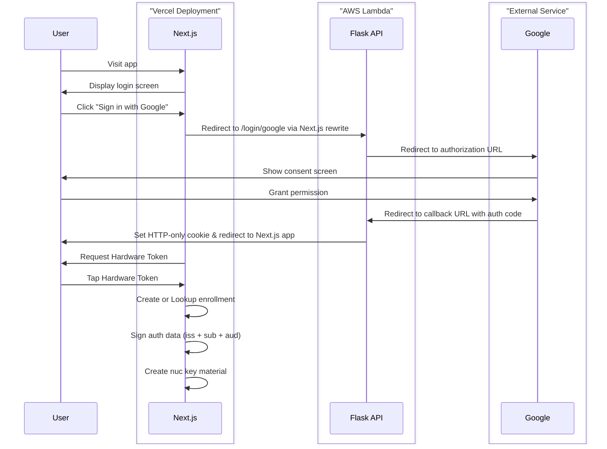

# 🔐 NIL-2FA


## ⚡ No-Wallet User Keys for Nillion Blind Computer

**Derive Nillion access keys from classic web2 authentication techniques — no crypto wallet needed!**



## 🚀 Why NIL-2FA?

NIL-2FA bridges the gap between traditional web2 authentication and secure key derivation for Nillion's blind computer.

### Key Features

- 🛡️ **Enhanced Security**: Hardware key-based deterministic signatures create robust salting
- 🌐 **Web2 Compatibility**: Uses familiar authentication patterns with no crypto wallet requirements
- 🔑 **User Control**: End-to-end control of private key material, without centralized key custody
- 🧩 **Zero-Knowledge Friendly**: Inspired by zkLogin techniques for zero-knowledge applications

## 💻 Core Security Goal

> At no time should a cloud provider, app administrator, or developer be able to covertly steal enough crypto seed (entropy) to make a brute force attack of secrets feasible.

## 🔍 Technical Approach

NIL-2FA uses deterministic ed25519 signatures from hardware keys to create cryptographic "salt" that ensures even if parts of the system are compromised, the complete key material remains secure.

This project was inspired by the [zkLogin paper](https://arxiv.org/pdf/2401.11735), particularly the section on "The Necessity of Salt".

## 🏗️ Getting Started

> get the code
```bash
# Clone the repository
git clone https://github.com/wwwehr/nil-2fa.git

```
> start the backend
```bash
# Navigate to backend directory
cd nil-2fa/backend

# Install dependencies
uv venv --python=$(which python3.11) 
source .venv/bin/activate
uv pip install -r requirements.txt

# Prepare secrets
cp .env.sample .env
nano .env

# Load secrets into environment
export $(cat .env)

# Run backend
FLASK_APP=app.py flask run
```

> In a new terminal, run the frontend
```bash
# Navigate to frontend directory
cd nil-2fa/frontend

# Install dependencies
pnpm i

# Run frontend
API_URL http://localhost:5000 pnpm dev
```

For frontend only, you can easily start a new project with:

```bash
pnpm dlx create-next-app@latest --use-pnpm --example https://github.com/wwwehr/nil-2fa --example-path frontend
```

## 🤝 Contributing

Contributions are welcome! Please feel free to submit a Pull Request.

1. Fork the repository
2. Create your feature branch (`git checkout -b feature/amazing-feature`)
3. Commit your changes (`git commit -m 'Add some amazing feature'`)
4. Push to the branch (`git push origin feature/amazing-feature`)
5. Open a Pull Request

## 📝 License

This project is licensed under the MIT License - see the [LICENSE](LICENSE) file for details.

## ⚠️ Disclaimer

This project is currently in **alpha** stage and is provided for testing purposes to demonstrate end-to-end user control of private key material.

---

<p align="center">Built with 💙 for the Nillion ecosystem</p>
